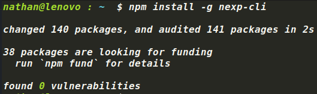
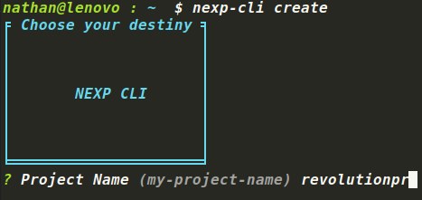
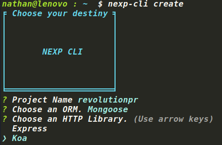
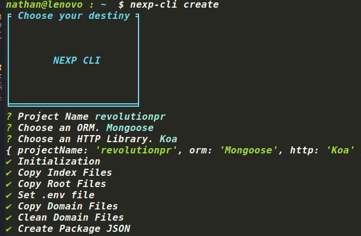

# Nexp-cli [![NPM version][npm-image]][npm-url]

> This CLI is made to be able to quickly create the NExp boilerplate with all the content you want it to have.
> 
> It allows you to choose between Mongoose, TypeORM and MikroORM when it comes to database persistence. In addition you can also choose between Koa and Express for the HTTP library.
> 
> This tool allows you to use NExp without the need to modify the code.

## Installation

First, install nexp-cli using [npm](https://www.npmjs.com/) (we assume you have pre-installed [node.js](https://nodejs.org/)).

```bash
npm install -g nexp-cli
```

Then generate your new project:

```bash
nexp-cli create
```

## Step by Step
#### First of all install nexp cli package globally.

 

#### Currently there is a `create` command call, in the future more commands will be added.


#### Write the name of the project.



#### Choose the ORM.


#### Choose the HTTP library.



#### And wait for each action to complete.



#### Copy .env.dev to .env and install dependencies with yarn or npm.


#### Execute `make dev command` or `STAGE=dev docker-compose up --build -d` to create docker containers.

* Node
* DB
* Redis
* Mail
* Minio


#### And it's ready to code.


## Next
* Choose more HTTP libs
* Possibility to choose between database drivers such as postgres, mysql etc.
* Creation of entire domains

MIT © [Nathan Russo]()


[npm-image]: https://badge.fury.io/js/generator-nexp-cli.svg
[npm-url]: https://npmjs.org/package/generator-nexp-cli
